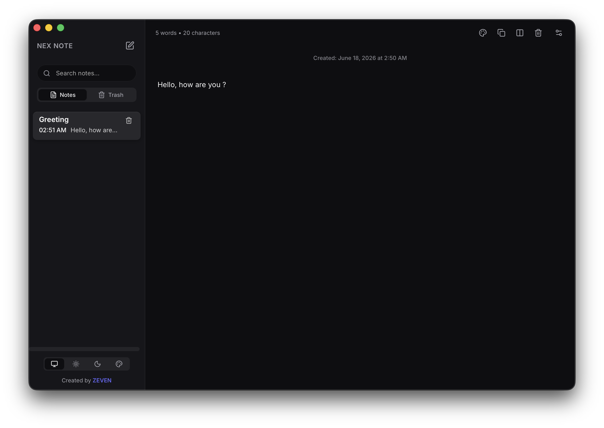
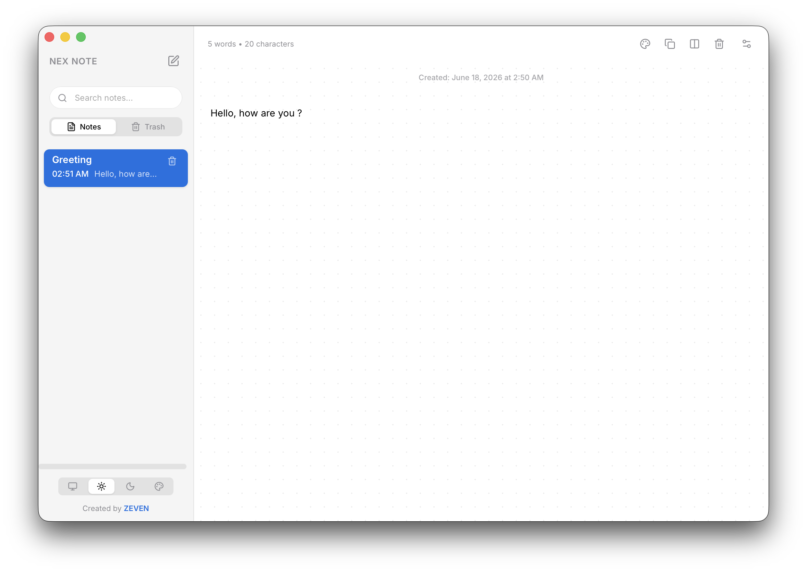
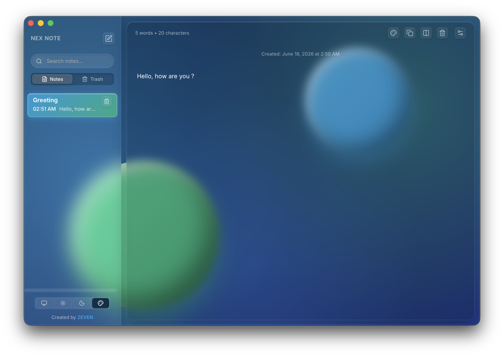
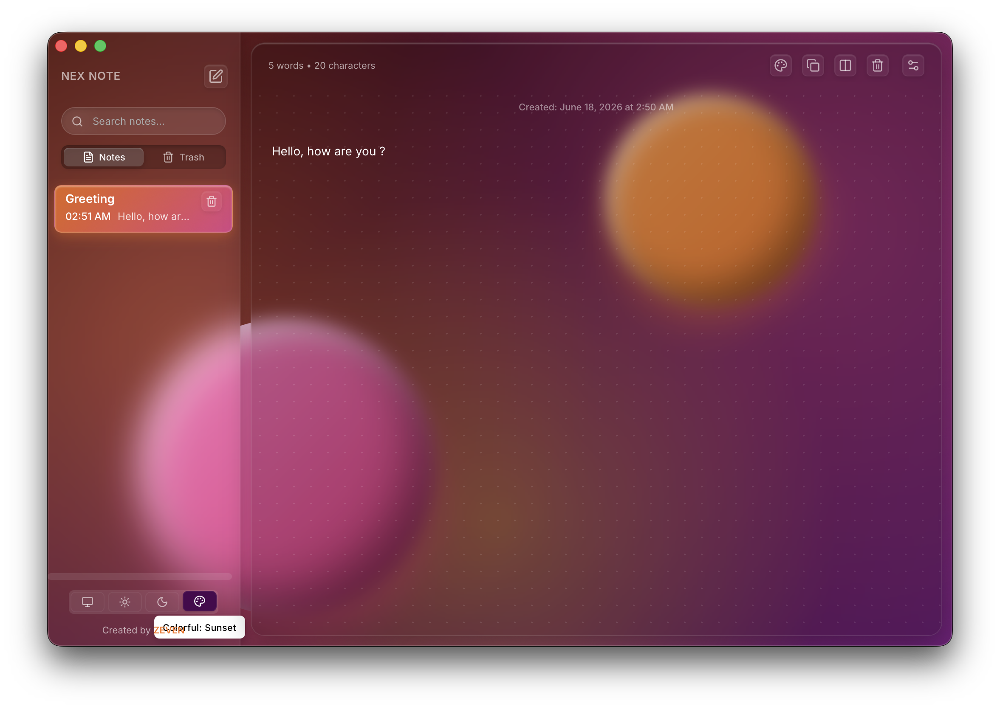

<h1 align="center">NexNote 🚀</h1>

<p align="center">
  <strong>A lightning-fast, beautifully designed, and highly customizable markdown note-taking application.</strong>
</p>

<p align="center">
  
  
  
  
</p>

---

## ✨ Features

- ⚡️ **Blazing Fast**: Rebuilt from the ground up using **Rust** and **Tauri v2** for near-instant startup times and zero lag.
- 🎨 **Stunning Themes**: Beautiful, glassmorphic UI with multiple themes (Light, Dark, Glossy, Ocean, Sunset, Forest).
- 📝 **Markdown Support**: Full GitHub-flavored markdown editor with a live side-by-side preview.
- 🔒 **Privacy First**: All your notes are stored locally on your machine. No cloud, no tracking.
- 🎯 **Distraction-Free**: Minimalist UI, smooth micro-animations, and a frameless window design.
- 📌 **Pin & Trash**: Easily pin important notes or recover deleted ones from the trash.

## 📸 Previews

Here are some previews of NexNote in different themes:

<p align="center">
  
  
</p>
<p align="center">
  
  
</p>


## 🚀 Installation (macOS)

1. Go to the [Releases](../../releases/latest) page.
2. Download the latest `NexNote.dmg` file.
3. Open the downloaded `.dmg` file and drag **NexNote** to your Applications folder.

> **Note**: Since the app is not signed with an Apple Developer certificate, you may need to right-click the app and select "Open" the first time you run it.

## 🛠️ Development

To build the project locally, you will need [Node.js](https://nodejs.org/) and [Rust](https://rustup.rs/).

```bash
# Clone the repository
git clone https://github.com/pxzeven/NexNote.git
cd NexNote

# Install dependencies
npm install

# Run in development mode
npm run tauri dev

# Build for production
npm run tauri build
```

## 🤝 Contributing

Contributions, issues, and feature requests are welcome! Feel free to check the [issues page](../../issues).

## 📄 License

This project is open-source and available under the [MIT License](LICENSE).

---
<p align="center">Created with ❤️ by <strong>ZEVEN</strong></p>
